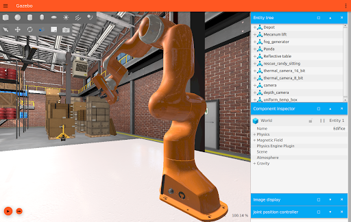

# About 
Gazebo brings a fresh approach to simulation with a complete toolbox of development libraries and cloud services to make simulation easy. Iterate fast on your new physical designs in realistic environments with high fidelity sensors streams. Test control strategies in safety, and take advantage of simulation in continuous integration tests. Full project details are available at [GazeboSim.org](https://gazebosim.org/home)

# Getting Started 
There are two major versions of Gazebo: Gazebo Classic, and Gazebo (formerly Ignition). Gazebo Classic releases use numbers to track versions while Gazebo uses lettered release names (e.g. Fortress, Garden, etc). A comparison between the two major versions of Gazebo can be [found here](https://gazebosim.org/docs/garden/comparisone). **We recommend new Gazebo users start with the lastest release [Gazebo Garden](https://www.openrobotics.org/blog/2022/10/3/gazebo-garden-released)**. Check out this video if you want to learn all about the new features in [Gazebo Garden](https://www.youtube.com/watch?v=k5vgdqjRWuw). 

Looking to get started with simulations in Gazebo? Our [installation guide is available here](https://gazebosim.org/docs/latest/ros_installation). If you want to install Gazebo and ROS together we recommend [this guide]((https://gazebosim.org/docs/latest/ros_installation)). Once you've installed Gazebo start learning with our [beginner tutorials](https://gazebosim.org/docs/garden/tutorials).

# Join the [Gazebo](https://gazebosim.org/home) Community

## Community Resources
* [Gazebo Discussion Forum](https://community.gazebosim.org/)
* [Gazebo Discord Server](https://discord.com/servers/open-robotics-1077825543698927656)
* [Robotics Stack Exchange](https://robotics.stackexchange.com/) (preferred Gazebo support forum).
* [Official Gazebo Videos](https://vimeo.com/osrfoundation)
* [Gazebo Resource Status Page](https://status.openrobotics.org/)

## Developer Resources
* [Gazebo Installation Instructions](https://gazebosim.org/docs/latest/ros_installation)
* [Gazebo Tutorials](https://gazebosim.org/docs/garden/tutorials)
* [Gazebo Documentation](https://gazebosim.org/docs)
* [Gazebo Website](https://gazebosim.org/home)
* [Gazebo Source Code](https://github.com/gazebosim)
* [Gazebosim Simulation Assets (aka Fuel)](https://app.gazebosim.org/fuel/models)
* [Gazebo Plugins](https://gazebosim.org/api/sim/7/createsystemplugins.html)
* [Gazebo Youtube Channel](https://www.youtube.com/@GazeboSim)
* [Gazebo Graphics and Trademark](https://gazebosim.org/media)

## Using ROS with Gazebo
* [ROS / Gazebo Installation Guide](https://gazebosim.org/docs/latest/ros_installation)
* [ROS 2 / Gazebo Project Template](https://github.com/gazebosim/ros_gz_project_template)
* [ROS 2 / Gazebo Example Code](https://github.com/gazebosim/ros_gz/tree/ros2/ros_gz_sim_demos)
* [TurtleBot4 Simulator](https://turtlebot.github.io/turtlebot4-user-manual/software/turtlebot4_simulator.html)
* [ROS / GZ Bridge](https://github.com/gazebosim/ros_gz)

## Events
* [ROSCon](https://roscon.ros.org), our yearly developer conference than includes Gazebo developers. 
* [Open Source Robotics Foundation Events Calendar](https://calendar.google.com/calendar/u/0/embed?src=agf3kajirket8khktupm9go748@group.calendar.google.com&ctz=America/Los_Angeles) -- [submit an event](https://bit.ly/OSRFCalendarForm)
* [Open Source Robotics Foundation Community Events Calendar](https://calendar.google.com/calendar/embed?src=c_3fc5c4d6ece9d80d49f136c1dcd54d7f44e1acefdbe87228c92ff268e85e2ea0%40group.calendar.google.com&ctz=America%2FLos_Angeles) -- [submit an event](https://bit.ly/OSRFCommunityCalendar)

## On Social Media
  * [Gazebo Sim Twitter](https://twitter.com/GazeboSim)
  * [Open Robotics on Twitter](https://twitter.com/OpenRoboticsOrg)
  * [Open Robotics on LinkedIn](https://www.linkedin.com/company/open-source-robotics-foundation)

Gazebo is made possible through the generous support of open source contributors and the non-profit [Open Source Robotics Foundation (OSRF)](https://www.openrobotics.org/). Tax deductible donations to the OSRF can be [made here.](https://donorbox.org/support-open-robotics?utm_medium=qrcode&utm_source=qrcode)

